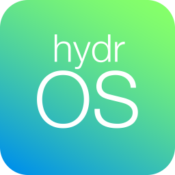

# HydroSoil hydrOS Operating System
[](https://gitHub.com/BlaT2512/HydroSoil/releases/)
[](https://github.com/BlaT2512/HydroSoil/blob/master/LICENSE)
[](https://gitHub.com/BlaT2512/HydroSoil/issues/)
[](https://travis-ci.com/BlaT2512/HydroSoil)
[](https://gitHub.com/BlaT2512/HydroSoil/stargazers/)




Official Repository for the hydrOS, the operating system behind HydroSoil: Smart Irrigation Solutions.

# FYI: hydrOS is still in beta and unsuitable for stable use. Ensure you back up your data or run this in a safe environment if testing.

# Installing, running and building hydrOS
The latest version of hydrOS comes standard with all official HydroSoil products, including HydroCore and HydroUnit products. The operating system can also be built from source code.
To build from source, install all dependencies for what you need as listed below.

## Dependencies
### hydrOS on HydroCore Linux package dependencies:
- Python 3 (python3) [latest version]
- Python GTK3 (libgtk-3-dev)
- Python GTK WebKit 3
- Mosquitto MQTT (mosquitto)
- Mosquitto MQTT Client (mosquitto-clients)
### hydrOS on HydroCore Python package dependencies:
- wireless
- wifi
- packaging
- paho-mqtt
### HydroUnit Standard C++ (Arduino) library dependencies:
- PubSubClient
- ESP8266WiFi (standard with the ESP8266 board package)

## Configuring HydroCore device for running hydrOS
First, connect the device to your desired WiFi network.
After this, configure the device by editing the Mosquitto configuration file with this command:

`sudo nano /etc/mosquitto/mosquitto.conf`

Remove this line from the bottom of the file:

`include_dir /etc/mosquitto/conf.d`

And then insert this at the bottom of the file:
```
allow_anonymous false
password_file /etc/mosquitto/pwfile
listener 1883
```
You can then exit out of Nano and save the file. In the Linux terminal, enter the following:

`sudo mosquitto_passwd -c /etc/mosquitto/pwfile SoilMeasurer`

When prompted for password, enter `HydroSoil123`

Once this is set up, change the device's hostname to `soilsystemmainunit`
Reboot the device.

# Changelog & planned upcoming changes
### v0.2-beta [LATEST PRE-RELEASE]
This second major pre-release of hydrOS brings huge performance & feature updates as well as bug fixes
Includes source code for hydrOS (Python), HydroLauncher (Python) and HydroUnit Standard (C++)
### New Features:
- Settings WiFi list showing available networks and disconnect functionality
- Settings page for changing weather location
- Radio buttons for changing the weather units (metric or imperial)
- Auto update refined and fixed for an even smoother experience
- Settings page for changing the time/date timezone and ability to sync the clock with NTP server
- New fluent, minimal dropdown notifications to replace bulky dialogs
- New red droplet icons for zones when critically low
- New fluent dropdown power menu
- Settings page to search for HydroUnit sensors and add them
- New plant/crop selection process with fluent dropdown
- Unregistered zones are now greyed-out on the Irrigation Zones page
- Initial setup process refined and fixed
- HydroSoil eManual reading capability in settings
- HydroCore factory reset capability
- Settings page GUI updated with sidebar
- HydroLauncher updated and refined
- HydroUnit Standard code heavily updated
- Tons of other bug fixes and small refinements
#### Known Issues:
- The zone/sensor config settings page is currently being worked on and not completed, a sample is included showcasing what it might look like
- Connection with the HydroSoil iOS app is not yet esatblished, but coming in the near future...
- HydroUnit Standard blue zone indicator light does not currently work

### v0.1-alpha
Initial pre-release of hydrOS
Includes source code for hydrOS (Python), HydroLauncher (Python) and HydroUnit Standard (C++)
#### New Features:
- Calendar page showing basic weather forecast for next 6 days and number of routines scheduled for each day
- Weather page showing detailed weather forecast for the current day and next 5 days
- Home page showing connected devices and status, simple weather forecast down the side and simple calendar at the bottom
- Zones page showing detail about each zone and allowing user to change mode, set Program mode schedule, change plant/crop and turn manual zone on/off
- Basic layout of most settings pages and the main settings page
- Header bar showing current local time in top-left corner and zone/WiFi status in top-right corner
- Menu bar allowing easy navigation between pages
- Automatic Updates - Detection of new release of hydrOS from Github and downloading required files and installing them
#### Known Issues:
- Settings pages currently do not work, the UI has only been created at the moment
- Multiple fatal errors occur when WiFi network is not connected
- HydroUnit Standard blue zone indicator light does not currently work
- Connection with the HydroSoil iOS app is not yet established
